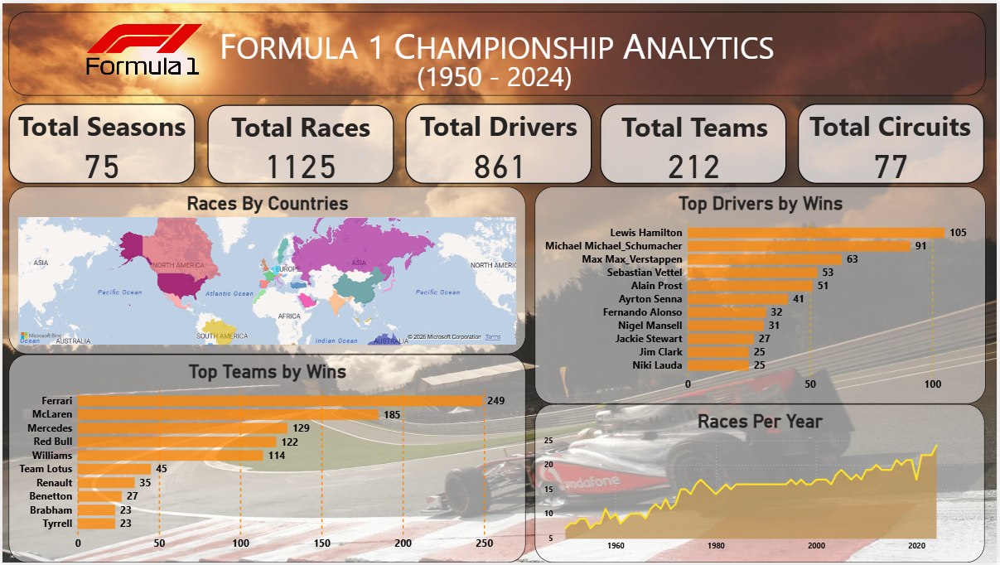
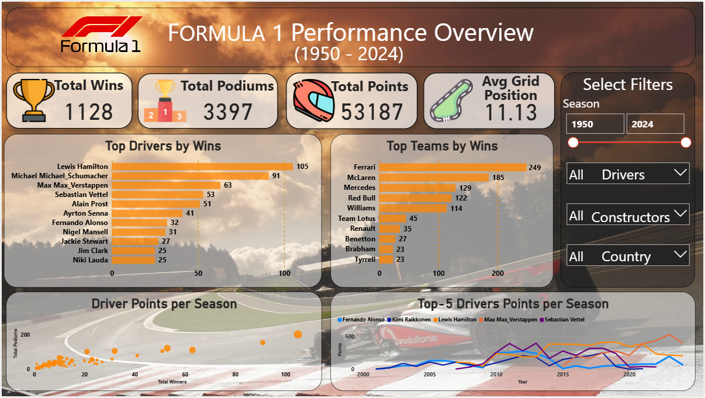
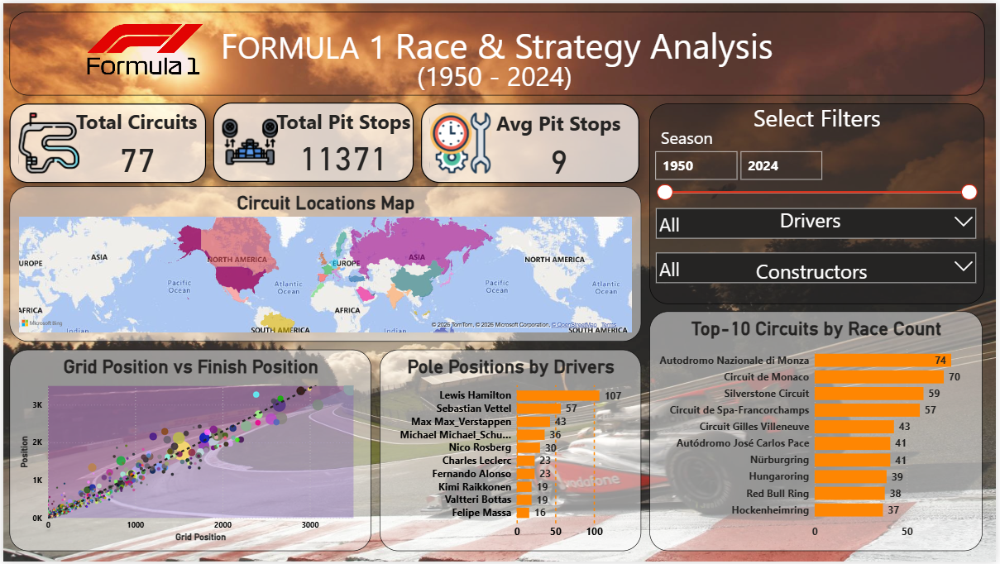
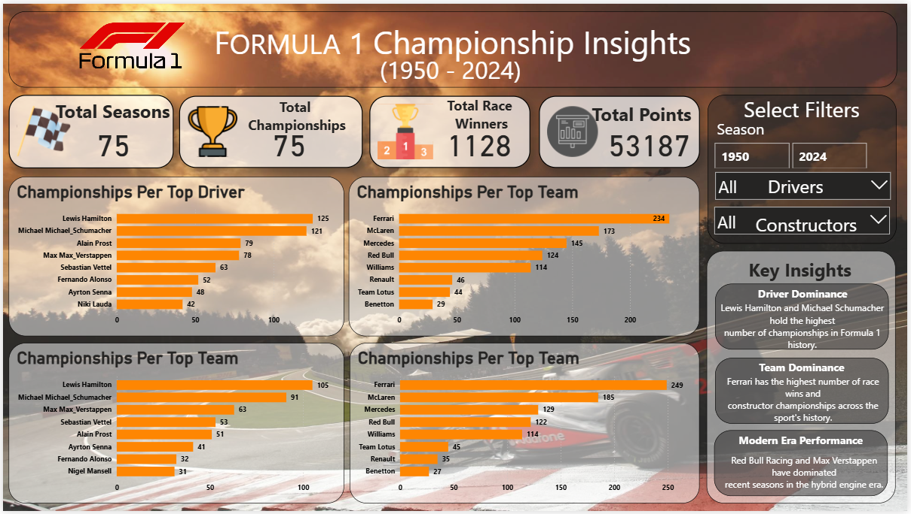

# 🏎️ Formula 1 Championship Analytics Dashboard

Data Analytics Portfolio Project analyzing **70+ years of Formula 1 data (1950–2024)** using **Power BI** to uncover insights about driver performance, constructor dominance, race strategies, and championship trends.

This project transforms raw motorsport data into interactive dashboards that provide meaningful insights into the evolution of Formula 1.

---

# 📊 Dashboard Preview

---

# 📖 Project Overview

Formula 1 is one of the most data-driven sports in the world. Over the decades, massive amounts of data have been generated from races, drivers, constructors, circuits, and race strategies.

The objective of this project is to analyze historical Formula 1 data and transform it into an interactive analytics dashboard that helps users explore:

- Driver performance across seasons
- Constructor dominance across eras
- Race strategy insights
- Pit stop efficiency
- Championship trends

The project demonstrates how **data analytics and visualization can turn raw sports data into actionable insights.**

---

# 🗂 Dataset Information

The dataset used in this project contains historical **Formula 1 World Championship data from 1950 to 2024**.

### Key Tables Used

- Drivers
- Constructors
- Races
- Results
- Qualifying
- Pit Stops
- Driver Standings
- Constructor Standings
- Circuits

### Dataset Coverage

- 75+ Seasons  
- 1100+ Races  
- 850+ Drivers  
- 200+ Constructors  
- 70+ Circuits  

---

# 📊 Dashboards

This project consists of **four interactive dashboards built in Power BI.**

---

## 1️⃣ FORMULA 1 CHAMPIONSHIP ANALYTICS

Provides a high-level overview of Formula 1 history including key statistics such as:

- Total Races
- Total Drivers
- Total Constructors
- Total Seasons

This dashboard helps users quickly understand the scale and growth of Formula 1 over time.

---

## 2️⃣ Performance Overview

This dashboard focuses on **driver and constructor performance** across seasons.

Key insights include:

- Most successful drivers in Formula 1 history
- Constructors with the highest number of wins
- Performance comparisons across teams and drivers

---

## 3️⃣ Race & Strategy Analysis

This dashboard explores **race dynamics and strategy factors**, including:

- Grid position vs finishing position
- Pit stop performance
- Circuit distribution
- Race performance patterns

These insights highlight how race strategy plays a critical role in determining outcomes.

---

## 4️⃣ Championship Insights

This dashboard focuses on **championship trends and historical dominance**.

It highlights:

- Championship winners across seasons
- Dominant teams across different eras
- Trends in Formula 1 competition

---

# 🔍 Key Insights

Some insights discovered from the analysis include:

- Drivers starting from **front grid positions** have significantly higher chances of winning races.
- Certain constructors have **dominated specific eras of Formula 1 history**.
- **Pit stop efficiency** has dramatically improved due to technological advancements.
- The number of races per season has increased significantly over the decades.

---

# 💡 Strategic Recommendations

Based on the analysis, several strategic insights can be derived:

- Teams should **prioritize qualifying performance** since starting position strongly influences race outcomes.
- **Optimizing pit stop strategies** can significantly improve race positions.
- Teams should **adapt car setup based on circuit characteristics**.
- Driver training should focus on **qualifying pace and race consistency**.

---

# 🛠 Tools & Technologies Used

- **Power BI** – Data visualization and dashboard development  
- **Excel** – Data preprocessing and preparation  
- **DAX (Data Analysis Expressions)** – Calculated measures and metrics  
- **Data Visualization Techniques** – Insightful dashboard design  

---

# 📁 Project Structure

formula1-powerbi-analytics
│
├── datasets
│ ├── drivers.csv
│ ├── constructors.csv
│ ├── races.csv
│ ├── results.csv
│ ├── pit_stops.csv
│ └── qualifying.csv
│
├── dashboards
│ └── Formula1_Analytics_Dashboard.pbix
│
├── images
│ ├── dashboard1_championship_analytics.png
│ ├── dashboard2_performance_overview.png
│ ├── dashboard3_race_strategy.png
│ └── dashboard4_championship_insights.png
│
├── presentation
│ └── Formula1_Analytics_Presentation.pptx
│
└── README.md

---

# 📈 Skills Demonstrated

This project demonstrates the following data analytics skills:

- Data Cleaning
- Data Modeling
- Data Visualization
- Dashboard Design
- DAX Calculations
- Analytical Storytelling

---

# 👨‍💻 Author

**Parth Sharma**  
B.Tech – Artificial Intelligence & Data Science  

Data Analytics | Power BI | Data Visualization

---

# ⭐ If you found this project interesting, feel free to give it a star!